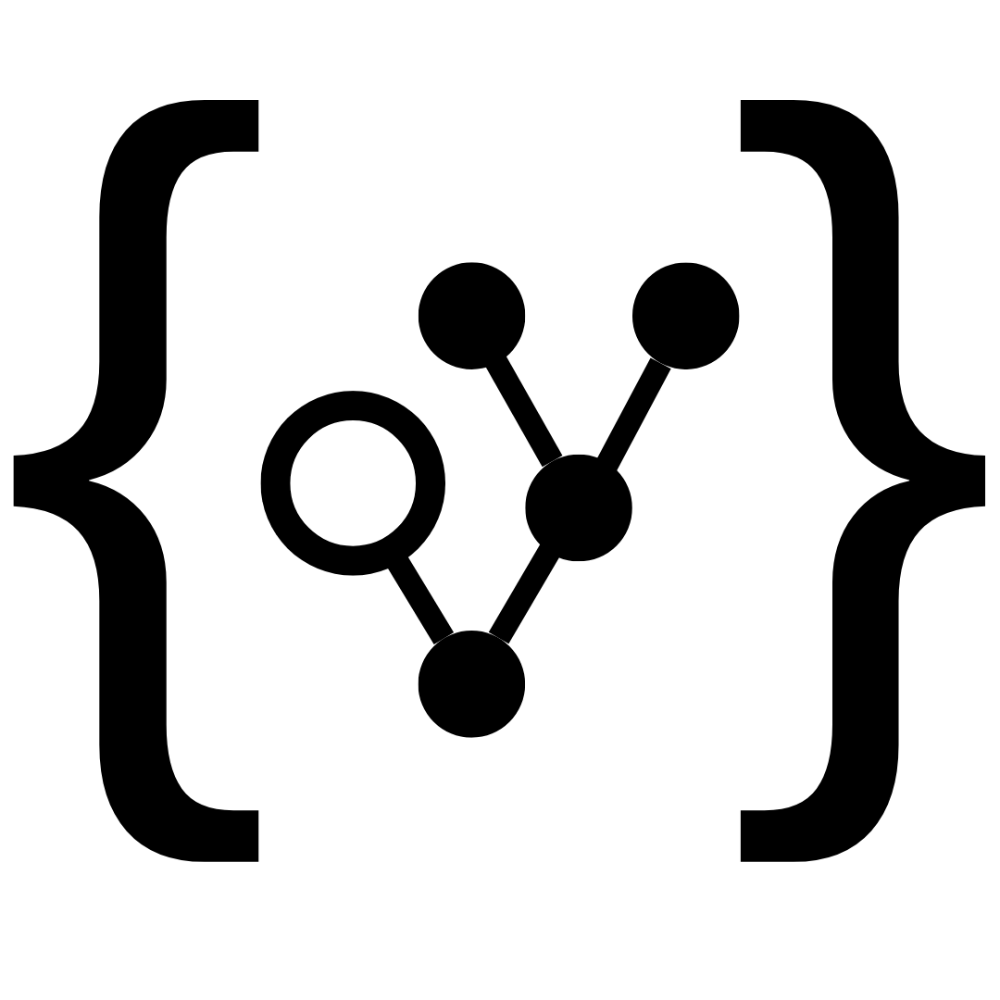

## Ruggle — Rust API Search for VS Code

Ruggle lets you search Rust APIs by name or function signature directly from VS Code. It connects to a local or remote Ruggle server to return precise matches with links to documentation.

- **Search by signature**: e.g. `fn (Option<Result<T, E>>) -> Result<Option<T>, E>`
- **Inline results**: name, module path, signature, and docs.rs link
- **Scopes**: search `set:libstd` or specific crates like `crate:serde`
- **Managed server**: auto-start a local server (configurable)
- **Index management**: install std/core/alloc index, add remote crates, index your workspace

> Marketplace listing: see the Overview tab after publish: [Ruggle on VS Code Marketplace](https://marketplace.visualstudio.com/items?itemName=AlperenKeles.ruggle&ssr=false#overview)

## Quick start

1. Install the extension (Ruggle).
2. Open a Rust project or any workspace.
3. Press the command palette and run:
   - `Ruggle: Install libstd/core/alloc Index` (once)
   - `Ruggle: Search APIs` or select code and run `Ruggle: Search Selection`

The extension will try to reach your configured server at `ruggle.host` (defaults to `http://localhost:8000`). If unreachable and `ruggle.autoStart` is enabled, it starts a managed local server.

## Commands

- **Ruggle: Search APIs** (`ruggle.search`)
- **Ruggle: Search Selection** (`ruggle.searchSelection`)
- **Ruggle: Set Server Host** (`ruggle.setHost`)
- **Ruggle: Show Logs** (`ruggle.showLogs`)
- **Ruggle: Set Scope** (`ruggle.setScope`)
- **Ruggle: Start Server** (`ruggle.startServer`)
- **Ruggle: Stop Server** (`ruggle.stopServer`)
- **Ruggle: Add/Update Crate in Index** (`ruggle.updateIndex`)
- **Ruggle: Install libstd/core/alloc Index** (`ruggle.installLibstdIndex`)
- **Ruggle: List Indexed Crates** (`ruggle.listIndexed`)
- **Ruggle: Index Current Project (Cargo.toml at workspace root)** (`ruggle.indexCurrentProject`)

## Settings

- **ruggle.host**: Base URL of the Ruggle server. Default: `http://localhost:8000`.
- **ruggle.scope**: Default search scope, e.g. `set:libstd`, `crate:serde`.
- **ruggle.limit**: Max results per search (default: 30).
- **ruggle.threshold**: Similarity threshold (default: 0.4; lower is more similar).
- **ruggle.autoStart**: Start local server automatically (default: true).
- **ruggle.serverMode**: `managed` | `cargo` | `binary` | `docker`.
- **ruggle.serverCommand**: When using `binary` mode, path to the server.
- **ruggle.indexDir**: Path to a `ruggle-index` directory for the server `--index`.
- **ruggle.port**: Port to expose for `docker` mode (default: 8000).
- **ruggle.repoRoot**: Repo root when using `cargo` mode.
- **ruggle.managed.serverUrl**: Direct URL to a prebuilt server binary for your platform.
- **ruggle.managed.indexUrl**: URL to a bundled std/core/alloc index archive.

## Tips

- Use `Ruggle: Set Scope` to switch quickly between `set:libstd` and your own crates.
- If results are sparse, increase `ruggle.limit` or raise `ruggle.threshold` slightly.
- Use `Ruggle: Show Logs` for troubleshooting server connectivity.

## License

MIT — see `LICENSE` in the extension folder.
